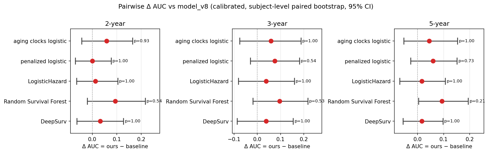

# Siamese Hazard — paired DNA-methylation model for MCI→AD progression

[](LICENSE)


> **Research project demonstration.** This repository packages the final model
> and headline results of a study on predicting disease progression from
> longitudinal DNA methylation. It is a reproducible research artifact, not a
> production library. The source methylation data is **not** included (it is
> governed by the ADNI data use agreement — see [`data/README.md`](data/README.md)).

## What this is

Given **two DNA-methylation draws** from the same subject (`t0`, `t1`) and the
time between them (`dt`), the model estimates the **cumulative risk of converting
from mild cognitive impairment (MCI) to Alzheimer's disease (AD)** at 2, 3 and 5
years:

```
(X0, X1, dt, E)  ──►  (p2, p3, p5)        calibrated, monotone cumulative risks
```

The core idea is twofold:

1. **Paired (Siamese) methylation.** Risk is driven by *within-person change*
   between two timepoints, not just a single baseline draw.
2. **Context-conditioned projection.** The 50,000-CpG methylation vector is
   projected to a small latent space through a map generated from **per-CpG
   biology** (sequence, gene, regulatory and SNP annotations), with a learned
   residual correction: `V = g(E) + α·W_free`.

Risk is modelled as a **discrete-time hazard** with three conditional heads
(`1→2y`, `2→3y`, `3→5y`) that are per-fold Platt-calibrated and composed into
**monotone** cumulative risks. See [`docs/model_contract.md`](docs/model_contract.md)
for the full pipeline contract.

## Headline result

On the ADNI MCI→AD cohort (N=190; 18 / 36 / 48 events at 2 / 3 / 5y), benchmarked
against four established survival learners and a panel of methylation aging clocks
under locked 5×5-fold cross-validation:

| Method | 2y AUC | 3y AUC | 5y AUC | **mean₂₃₅** |
|---|---:|---:|---:|---:|
| **Siamese Hazard (this work)** | **0.734** | **0.660** | 0.680 | **0.687** |
| Methylation aging clocks | 0.658 | 0.647 | **0.693** | 0.665 |
| Penalised Cox (per horizon) | 0.727 | 0.620 | 0.654 | 0.655 |
| Random survival forest | 0.696 | 0.578 | 0.629 | 0.646 |
| Logistic hazard (Nnet-survival) | 0.674 | 0.605 | 0.634 | 0.635 |
| DeepSurv | 0.640 | 0.581 | 0.630 | 0.625 |

*Median calibrated AUC across 5 seeds. `mean₂₃₅` = mean AUC over the three horizons.*

The proposed model has the **highest median `mean₂₃₅`** and wins 14 of 15 pairwise
comparisons on point estimates. At N=190 no comparison reaches Holm-corrected
significance, so the honest framing is *"competitive with or better than every
benchmark, with sample size limiting power for definitive claims."* The conclusion
is **stable across three different context files**. Full write-up, statistics,
robustness and limitations: [`results/external_benchmark_summary.md`](results/external_benchmark_summary.md).



## How the model got here

The final model is the end of a line of iterations, each changing one thing —
risk definition, calibration, or projection. The full story (per-window baseline →
monotone hazards → robust calibration → learnable Platt → context projection →
residual context projector) is in
[`docs/model_evolution.md`](docs/model_evolution.md).

## Repository layout

```
siamese_hazard/          The model and its training / evaluation pipeline
├── model.py             ContextSiameseHazardNet: residual context projector + hazard core
├── context.py           Loads/aligns/scales the per-CpG context matrix E
├── context_features.py  Generic context-matrix loader (annotation → features)
├── data.py              Design-file loading, β→M conversion, masked hazard labels
├── calibration_layer.py Per-fold multi-head Platt calibration (LBFGS)
├── metrics.py           AUC / PR-AUC / Brier / ECE / decision-curve analysis
├── baselines.py         Logistic-regression reference baselines (latent, latent+Δ)
├── train.py             5-fold CV training + calibration + composition (CLI)
├── explain.py           Per-CpG permutation-importance interpretability panel (CLI)
└── explain_common.py    Shared interpretability helpers
docs/                    Model contract, evolution narrative, benchmark methods
results/                 Curated headline tables, figures, revision analyses
data/                    Data contract (the data itself is not distributed)
```

## Installation

```bash
# Python 3.11, PyTorch 2.x (CUDA optional but recommended)
python -m venv .venv && . .venv/bin/activate
pip install -r requirements.txt
```

The optional comparators used to reproduce the external benchmark
(scikit-survival, lifelines, pycox, pyaging) are commented out in
`requirements.txt`; they are only needed to regenerate `results/`.

## Usage

### Train (5-fold CV + calibration + composition)

```bash
python -m siamese_hazard.train \
  --data_dir    data \
  --context_csv data/cpg_context.csv \
  --model_dir   model_runs \
  --results_dir results_runs \
  --proj_dim 64 --ctx_hidden 32 --emb_dim 128 \
  --batch_size 32 --lr 3e-4 \
  --triplet_weight 0.1 --triplet_margin 0.2 \
  --projector_type residual --stop_metric mean_auc_235 \
  --seed 42
```

Outputs land in `results_runs/siamese_hazard/`:

```
run_config.json                      resolved hyperparameters
context_preprocess_summary.json      z-score / block-scaling report for E
oof_hazards_and_risks_perhead.csv    OOF logits, raw + calibrated probs, p2/p3/p5
metrics_perhead.csv                  per-horizon AUC / PR-AUC / Brier / ECE / N
dca_perhead_{2y,3y,5y}.csv           decision-curve analysis
calibrators_platt/                   per-fold Platt parameters
```
and per-fold checkpoints under `model_runs/siamese_hazard/fold_k/best.ckpt`.

To emulate a pure context projection (ablation), pass
`--projector_type context_only`.

### Interpret (per-CpG importance panel)

```bash
python -m siamese_hazard.explain \
  --model_dir   model_runs \
  --results_dir results_runs \
  --horizons all --panel_size 30
```

This reads a completed run, computes per-CpG permutation importance through the
projector, and writes a voted top-N CpG panel.

## Data

Not distributed. The required design files and context matrix, and their exact
column contract, are documented in [`data/README.md`](data/README.md).

## Citation

If you use this work, please cite it via [`CITATION.cff`](CITATION.cff).

## License

[MIT](LICENSE).
